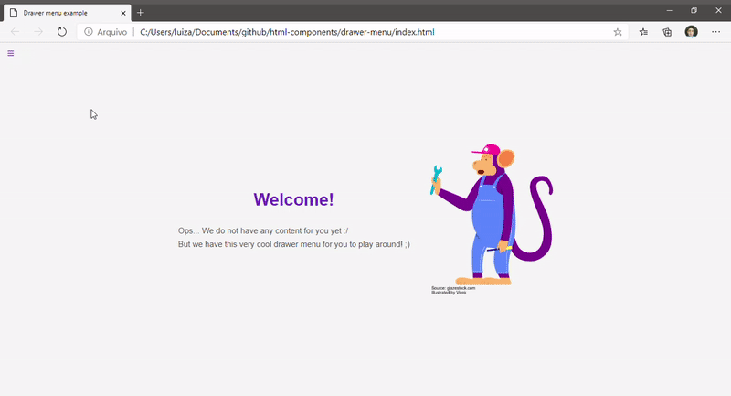
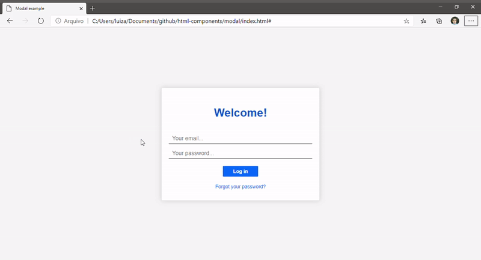
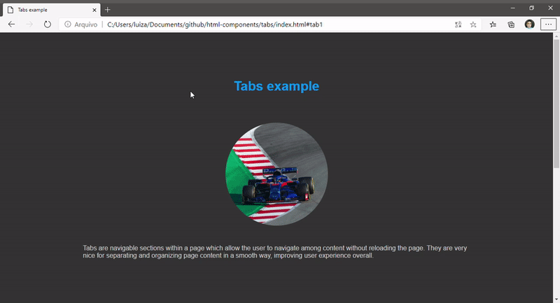

<h1 align="center">Web Components with pure HTML, JavaSript and CSS</h1>

<h3>Some of the main components I used from libraries such as Materialize CSS and Bootstrap built in pure HTML and JS</h3>

Throught 2019 I'd been working on MEAN stack, obviously as a fullstack developer. But the problem was: I was much more technical than artistic. And the reason why is not any surprise, I was always passionated about backend development. Because of that, I was so dependant on JQuery and CSS libraries such as Materialize CSS and Bootstrap.

Being dependant on these libraries was limitating me when it came to frontend development, because I was always designing apps with the very same layout pattern, and I always needed to trust these libraries, which sometimes had bothering issues.

With that in mind, I decided that in 2020 I was going to change it, I was going to focus more on frontend development instead of bakcend development in order to find a balance beetwen the two sides of software development. So, these are some of the components I used the most in these libraries previously mentioned, which I developed in hard coded way. Obviously using libraries such as Vue.JS or ReactJS would be much easier, but I decied to jump out of the comfort zone and trail the hard way, so that I will have no worries.

<table>
    <tr><td align="center"><strong>Drawer Menu</strong></td></tr>
    <tr>
        <td>
            
        </td>
    </tr>
    <tr><td align="center"><strong>Modal</strong></td></tr>
    <tr>
        <td>
            
        </td>
    </tr>
    <tr><td align="center"><strong>Tabs</strong></td></tr>
    <tr>
        <td>
            
        </td>
    </tr>
</table>

